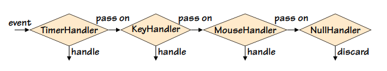

# Comportamentale - Chain of Responsibility

Il pattern **Chain of Responsibility** viene utilizzato per separare il codice che invia una richiesta da quello che la gestisce. Invece di invocare direttamente una funzione, la richiesta viene passata a una catena di gestori, dove ciascuno di essi può elaborarla o passarla al successivo.

### Funzionamento
Quando un evento viene generato, il primo gestore della catena decide se gestirlo o inviarlo al successivo. Se l'evento non viene gestito fino all'ultimo gestore, può essere scartato o può essere lanciata un'eccezione.

### Diagramma di Gestione degli Eventi


### Esempio di Implementazione

```python
# Classe base per i gestori di eventi
class NullHandler:
    def __init__(self, successor=None):
        self._successor = successor

    def handle(self, event):
        if self._successor is not None:
            self._successor.handle(event)

# Gestore per eventi del mouse
class MouseHandler(NullHandler):
    def handle(self, event):
        if event.kind == Event.MOUSE:
            print("Click: {}".format(event))
        else:
            super().handle(event)

# Gestore per eventi della tastiera
class KeyHandler(NullHandler):
    def handle(self, event):
        if event.kind == Event.KEYPRESS:
            print("Press: {}".format(event))
        else:
            super().handle(event)

# Gestore per eventi temporizzati
class TimerHandler(NullHandler):
    def handle(self, event):
        if event.kind == Event.TIMER:
            print("Timer event: {}".format(event))
        else:
            super().handle(event)

# Creazione della catena di gestori
handler1 = TimerHandler(KeyHandler(MouseHandler(NullHandler())))

# Ciclo principale per gestire gli eventi
while True:
    event = Event.next()
    if event.kind == Event.TERMINATE:
        break
    handler1.handle(event)
```

### Descrizione delle Classi
- **NullHandler**: Serve come classe base. Passa l'evento al successore se presente.
- **MouseHandler**, **KeyHandler**, **TimerHandler**: Gestiscono eventi specifici e inviano eventi non gestiti al successore.

### Esempio di Debugging

```python
import sys

class DebugHandler(NullHandler):
    def __init__(self, successor=None, file=sys.stdout):
        super().__init__(successor)
        self.__file = file

    def handle(self, event):
        self.__file.write("*DEBUG*: {}\n".format(event))
        super().handle(event)

# Utilizzo di DebugHandler come primo gestore
debug_handler = DebugHandler(handler1)

while True:
    event = Event.next()
    if event.kind == Event.TERMINATE:
        break
    debug_handler.handle(event)
```

### Coroutine per Gestione degli Eventi

Le coroutine possono essere utilizzate per creare una catena di responsabilità in modo più semplice. Le coroutine sono funzioni che possono mantenere il loro stato tra le invocazioni grazie all'uso dell'istruzione `yield`.

```python
import functools

def coroutine(function):
    @functools.wraps(function)
    def wrapper(*args, **kwargs):
        generator = function(*args, **kwargs)
        next(generator)  # Avanza al primo yield
        return generator
    return wrapper

@coroutine
def key_handler(successor=None):
    while True:
        event = (yield)
        if event.kind == Event.KEYPRESS:
            print("Press: {}".format(event))
        elif successor is not None:
            successor.send(event)

# Inizializzazione dei gestori
mouse_handler = MouseHandler()
pipeline = key_handler(mouse_handler)

# Ciclo principale
while True:
    event = Event.next()
    if event.kind == Event.TERMINATE:
        break
    pipeline.send(event)  # Invia l'evento alla pipeline
```

### Conclusione
Il pattern Chain of Responsibility permette di gestire eventi in modo flessibile, separando il codice di invio da quello di gestione. Utilizzando coroutine, possiamo semplificare ulteriormente la struttura del codice, mantenendo la logica di gestione degli eventi pulita e facilmente estensibile.