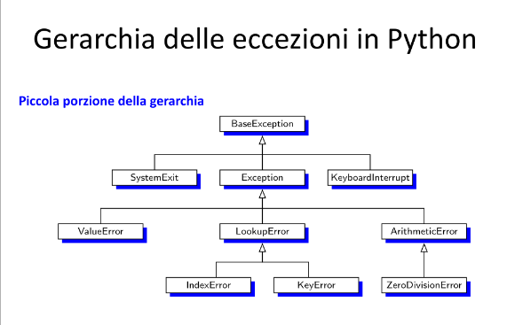
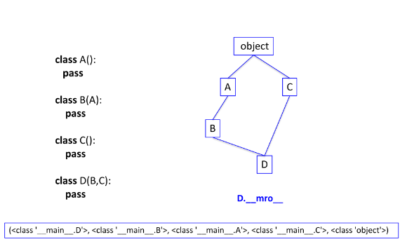

## Ereditarietà
- È supportata da Python come segue:
```python
class DerivedClassName(BaseClassName):
    <statement-1>
    ...
    <statement-N>
```
- **BaseClassName** deve essere definita nello scope che contiene la definizione della classe derivata **DerivedClassName**
- Si possono usare classi base definite in altri moduli
```python
class DerivedClassName(modname.BaseClassName):
```


- Le classi derivate possono:
  - aggiungere variabili di istanza 
  - sovrascrivere i metodi della classe base
  - accedere ai metodi e variabili della classe base
- Python supporta l'ereditarietà multipla

```python
class DerivedClassName(Base1, Base2, Base3):
    <statement-1>
    ...
    <statement-N>
```
## Utilizzo metodo classi base con __super()__
- Per invocare metodi di istanza definiti NELLA classe base che sono stati SOVRASCRITTI con la derivazione, si usa la funzione super()
  - super().nome_metodo(argomenti)
- Oppure
  - BaseClassName.nome_metodo(self, argomenti)
  - funziona quando BaseClassName è accessibile come BaseClassName nello scope globale
- Ancora
  - super(DerivedClassName, self).nome_metodo(parametri)

```python
class Base:
    def __init__(self, a, b):
        self._a = a
        self._b = b
    def stampa(self):
        print('<{0}>,<{1}>'.format(self._a, self._b))
        
class Derivata(Base):
    def __init__(self, a, b, c):
        super().__init__(a, b)
        self._c = c

    def stampa(self):
        print('[{0}]-[{1}]'.format(self._a, self._b))

>>> b = Base(1, 3)
>>> b.stampa()
<1> <3>
>>> d = Derivata('a', 'b', '9')
>>> d.stampa()
[a]-[b]
```

```python
class base:
    def f(self):
        print("base")

class der(base):
    def f(self):
        print("der")

    def g(self):
        self.f()
        super().f()
        super(der, self).f()
        base.f(self)

class derder(der):
    def f(self):
        print("derder")

    def h(self):
        self.f()
        super().f()
        super(derder, self).f()
        super(der, self).f()

>>> x = der()
>>> x.g()
der
base
base 
base

>>> y = derder()
derder
der
der 
base
```

## Ereditarietà Multipla e Method Resolution Order (MRO)
- Nella classe derivata la ricerca degli attributi ereditati da una classe genitore avviene:
  - dal basso verso l'alto, e da sinistra verso destra
- class DerivedClassName(Base1, Base2, Base3):
  - se un attributo non è trovato in DerivedClassName, lo si cerca in Base1, dopo (ricorsivamente) nelle classi base di Base1, e, se non è trovato si procede con Base2 e così via
<br>
- L'attributo \_\_mro__ di una classe contiene l'elenco delle classi in cui si cerca il metodo/attributo che è stato invocato su un'istanza della classe.
  - Le classi sono esaminate seguendo l'ordine indicato da \_\_mro__
  - è di sola lettura
  - il metodo mro() è invocato quando si crea un'istanza della classe. Può essere sovrascritto per modificare l'ordine in cui vengono cercati i metodi nelle classi che formano la gerarchia.
  - l'ordine stabilito da mro() è memorizzato in \_\_mro__


## Attributo __bases__
- Contiene la tupla delle classi base di una classe
  - è accessibile in lettura/scrittura
  - modificando \_\_bases__ l'attributo \_\_mro__ è ricomputato
- per modificare \_\_bases__ si usa la funzione **setattr**
```python
setattr(Derivata, '__bases__', (Base2, Base1))
```

## Funzioni Built-In
- **isinstance(ist, classe)** verifica il tipo di un'istanza di una classe
```python
f = 3.4
print(isinstance(f, float)) --> True
```
- **issubclass(x, y)** verifica se x è una sottoclasse di y, restituisce True o False
```python
issubclass(A, C)
```

## Ordine differente rispetto a MRO
- Se noi abbiamo delle classi A, B e C con un metodo 'metodo_base' e D sia derivata di A, B, e C, con d una sua istanza.
- Se eseguiamo d.metodo_base(parametri) eseguiremo metodo_base della prima classe padre definita in \_\_mro__, che è A.
- Se noi volessimo invocare metodo_base di un'altra classe dovremmo porre un riferimento direttamente alla classe base specifica.

```python
class A:
    def __init__(self, a, val):
        self._a = a
        self._val = val
    
    def stampa(self):
        print('a =', self._a, 'val =', self._val)

class B:
    def __init__(self, b, val):
        self._b = b
        self._val = val
    
    def stampa(self):
        print('b =', self._b, 'val =', self._val)

class C:
    def __init__(self, c, val):
        self._c = c
        self._val = val
    
    def stampa(self):
        print('c =', self._c, 'val =', self._val)

class D(A, B, C):
    def __init__(self, a, b, c, val):
        A.__init__(self, a, val)
        B.__init__(self, b, 2 * val)
        C.__init__(self, c, 3 * val)

    def stampa(self):
        C.stampa(self)
        B.stampa(self)
        A.stampa(self)

# Create an instance of class D and call the stampa method
>>> d = D(1, 2, 3, 123)
>>> d.stampa()

c = 3 val = 369
b = 2 val = 246
a = 1 val = 123
```

## Iteratori
- Se una classe supporta l'iteratore possiamo ottenere un riferimento ad esso tramite la funzione **iter()**
  - si invoca iter su un'istanza della classe
- Per ottenere il prossimo elemento invochiamo next() sull'iteratore ottenuto
- Viene lanciata un'eccezione quando non ci sono più elementi nell'istanza della classe

```python
lista = [85,23,59]
print(lista)
[89, 23, 59]
it = iter(lista)
print(it)
<list_iterator object at 0x10217aa58>
print(next(it))
89
print(next(it))
23
print(next(it))
59
print(next(it))
Traceback (most recent call last):
    File "/Users/adb/Documents/r.py", line 8, in <module> print(next(it))
StopIteration
```

### Gestire l'eccezione
```python
lista=[59, 42, 90]
print(lista)
it = iter(lista)
print(it)

while True:
    try:
        print(next(it))
    except Exception as e:
        break
```

# Generatori
- Una funzione generatore è un modo semplice ed immediato per creare un iteratore (detto generatore)
  - I metodi del generatore \_\_iter__() e \_\_next__() sono creati automaticamente
    - \_\_iter__(): restituisce l'iteratore stesso
    - \_\_next__(): viene utilizzato nei cicli per ottenere il prossimo elemento
  - La sintassi per definire una funzione generatore è simile a quella usata per definire una funzione, ma al posto di return si usa **yield**
  - Quando si incontra un **yield** l'esecuzione del generatore è sospesa, viene restituito il valore indicato da **yield**
  - Ogni volta che si chiama **next()** il generatore riparte da dove l'esecuzione era stata sospesa.
    - Si parte dall'istruzione successiva a yield
- NOTA: yield e return nella stessa funzione NON possono coesistere!
```python
def gen_range(n):
    k = 0
    while k < n:
        yield k
        k += 1

for i in gen_range(10):
    print(i, end=' ')

# versione migliorata con gestione dell'eccezione:

ite = gen_range(10)
while(True):
    try:
    i = next(ite)
    print(i, end=' ')
    except Exception as e:
        break

0 1 2 3 4 5 6 7 8 9
```

```python
def reverse(data):
    for index in range(len(data)-1, -1, -1):
        yield data[index]

for char in reverse('programmazione'):
    print(char, end='')

enoizammargorp
```

## Superclassi Astratte
- Una superclasse Astratta è una classe il cui comportamento è in parte specificato dalle sottoclassi
- Se un metodo definito dalle sottoclassi non è definito dalla sottoclasse allora Python lancia un'eccezione quando effettua la ricerca del metodo nella gerarchia delle classi.
- Per rendere più evidente ciò che deve essere specificato nelle sottoclassi, si usa **assert** o **raise NotImplementedError**
```python
class Super:
    def delegate(self):
        self.action()
    def action(self):
        assert False, 'action must be defined!'

>>> X = Super()
>>> X.delegate()
AssertionError: action must be defined!
```
```python
# codice analogo, vedi differenza tra assert e raise
class Super:
    def delegate(self):
        self.action()
    def action(self):
        raise NotImplementedError('action must be defined!')

>>> X = Super()
>>> X.delegate()
NotImplementedError:: action must be defined!
```

```python
# continuiamo con gli esempi
>>> class Sub(Super): pass
>>> X = Sub()
>>> X.delegate()
NotImplementedError: action must be defined!
>>> class Sub(Super):
        def action(self): print('spam')
>>> X = Sub()
>>> X.delegate()
spam
```
- assert expression
  - è equivalente a
  - if \_\_debug: <br> if not expression: raise AssertionError
- Se eseguiamo il codice Python con il parametro -O non verranno stampati gli output di debug od i raise.

## Abstract Base Class (ABC)
- Rappresenta un ulteriore strumento per definire superclassi astratte.
- Python, tramite il modulo **abc**, fornisce il supporto per definire formalmente una classe di base astratta.
- ABCMeta assicura che il costruttore della classe lanci un'eccezione quando si tenta di instanziare la classe astratta.
- @abstractmethod è un decoratore, se non si fornisce un'implementazione Python verrà impedito di instanziare le sottoclassi che non implementano i metodi dichiarati astratti.
- Quindi, sebbene richieda la conoscenza di strumenti più avanzati, il vantaggio è che l'errore comparirà alla creazione dell'istanza e non quando invocheremo il metodo.

```python
from abc import ABCMeta, abstractmethod

class Sequence(metaclass=ABCMeta):
  
@abstractmethod
def __len__(self):
    """Return the length of the sequence"""

@abstractmethod
def __getitem__(self, j):
    """Return the element at index j of the sequence"""
```