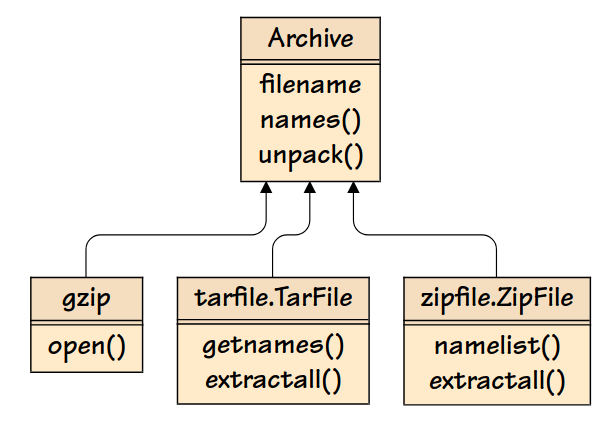

# Strutturale - Facade o Context Manager

Il design pattern facade fornisce un’interfaccia semplificata per un sistema costituito da interfacce o classi troppo complesse o troppo di basso livello.

- La libreria standard di Python fornisce moduli per gestire file compressi gzip, tarballs e zip. Questi moduli hanno interfacce diverse.
- Immaginiamo di voler accedere ai nomi di un file di archivio ed estrarre i suoi file usando un’interfaccia semplice.
- **Soluzione**: usiamo Facade per fornire un’interfaccia semplice ed uniforme che delega la maggior parte del vero lavoro alla libreria standard.

)

```python
import os
import string
import re
import tarfile
import zipfile
import gzip


class Archive:
    def __init__(self, filename):
        self._names = None  # Callable che restituisce una lista dei nomi dell'archivio
        self._unpack = None  # Callable che estrae tutti i file dell'archivio nella directory corrente
        self._file = None  # File object aperto per accedere all'archivio
        self._filename = filename  # Nome del file di archivio

    @property
    def filename(self):
        return self._filename

    @filename.setter
    def filename(self, name):
        self.close()  # Chiude l'archivio
        self._filename = name  # Aggiorna il nome del file (ma non lo apre)

    def close(self):
        """Chiude il file object e invalida i riferimenti."""
        if self._file is not None:
            self._file.close()
        self._names = self._unpack = self._file = None

    def __enter__(self):
        """Rende Archive un context manager."""
        return self

    def __exit__(self, exc_type, exc_value, traceback):
        self.close()

    def _prepare(self):
        """
        Prepara l'archivio impostando i callable per _names e _unpack.
        """
        if self.filename.endswith((".tar.gz", ".tar.bz2", ".tar.xz", ".zip")):
            self._prepare_tarball_or_zip()
        elif self.filename.endswith(".gz"):
            self._prepare_gzip()
        else:
            raise ValueError(f"Unreadable: {self.filename}")

    def names(self):
        """
        Restituisce i nomi dei file nell'archivio.
        """
        if self._file is None:
            self._prepare()
        return self._names()

    def unpack(self):
        """
        Estrae i file dall'archivio se tutti i nomi sono sicuri.
        """
        if self._file is None:
            self._prepare()
        self._unpack()

    def is_safe(self, filename):
        """
        Verifica se un nome di file è sicuro per l'estrazione.
        """
        return not (
            filename.startswith(("/", "\\")) or
            (len(filename) > 1 and filename[1] == ":" and filename[0] in string.ascii_letters) or
            re.search(r"[.][.][/\\]", filename)
        )

    def _prepare_tarball_or_zip(self):
        """
        Prepara un archivio .tar.* o .zip.
        """
        def safe_extractall():
            unsafe = [name for name in self.names() if not self.is_safe(name)]
            if unsafe:
                raise ValueError(f"Unsafe to unpack: {unsafe}")
            self._file.extractall()

        if self.filename.endswith(".zip"):
            self._file = zipfile.ZipFile(self.filename)
            self._names = self._file.namelist
            self._unpack = safe_extractall
        else:  # .tar.gz, .tar.bz2, .tar.xz
            suffix = os.path.splitext(self.filename)[1]
            self._file = tarfile.open(self.filename, f"r:{suffix[1:]}")
            self._names = self._file.getnames
            self._unpack = safe_extractall

    def _prepare_gzip(self):
        """
        Prepara un file .gz.
        """
        self._file = gzip.open(self.filename)
        filename = self.filename[:-3]
        self._names = lambda: [filename]

        def extractall():
            with open(filename, "wb") as file:
                file.write(self._file.read())

        self._unpack = extractall

```

- Il Pattern Facade permette di creare interfacce semplici e comode che ci permettono di ignorare dettagli di basso livello. 
- Uno svantaggio di questo Design Pattern potrebbe essere quello di non consentire un controllo più fine. 
- Tuttavia, facade non nasconde od elimina le funzionalità del sistema sottostante e così è possibile usare un facade passando a classi di più basso livello se necessitiamo di maggior controllo.

```python
with Archive(zipFilename) as archive:
	print(archives.names())
	archive.unpack()
```

# Context Manager

I Context Manager ci consentono di allocare e rilasciare risorse quando vogliamo. Se ci sono errori durante l’utilizzo cerca di chiuderlo.

```python
with open('some_file' 'w') as opened_file:
	opened_file.write('Hola!')
```
  - apre il file
  - scrive alcuni dati in esso
  - e lo chiude
  - se verifica un errore mentre scrive i dati, cerca di chiuderlo

```python
#codice equivalente
file = open('some_file', 'w')
try:
	file.write('Hola!')
finally:
	file.close()
```

- È possibile implementare un Context Manager come una classe. È sufficiente definire __enter__() ed __exit__() per usare la classe in uno statement with

```python
class File:
	def __init__(self, file_name, method):
		self.file_obj = open(file_name, method)

	def __enter__(self):
		return self.file_obj

	def __exit__(self, type, value, traceback):
		self.file_obj.close()
```

## Come funziona lo Statement With

- Immagazzina il metodo \_\_exit__() della classe File
- Invoca il metodo \_\_enter__() della classe File
    - il metodo \_\_enter__ restituisce il file object per il file aperto
- L’object file è passato ad opened_file
- Dopo che è stato eseguito il blocco al suo interno, lo statement with invoca il metodo \_\_exit__()
    - chiude il file
 
```python
with File('demo.txt', 'w') as opened_file:
    opened_file.write('Hola!')
```

## Context Manager ed Eccezioni
- Se tra il momento in cui viene passato l’object file a opened_file e il momento in cui viene invocata la exit si verifica un’eccezione, Python passa: type, value e traceback dell'eccezione agli argomenti di \_\_exit__() per gestire l’eccezione. 
- In questo caso decide come chiudere il file e se eseguire altri passi. 
In questo esempio gli argomenti che vengono passati sono ignorati ed il comportamento default è chiudere il file.
    - Se __exit__() restituisse True, l’eccezione NON verrebbe rilanciata dallo statement with.
    - Se __exit__() restituisse un altro valore l’eccezione verrebbe lanciata dallo statement with
    - Nel nostro esempio restituisce None per cui lancia l’eccezione.
```python
with File('demo.txt', 'w') as opened_file:
    opened_file.undefined_function('Hola!')

Traceback (most recent call last):
    File "<stdin>", line 2, in <module>
AttributeError: ‘file’ object has no attribute 'undefined_function'
```

### Proviamo invece a gestire l'eccezione
```python
class File(object):
  def __init__(self, file_name, method):
        self.file_obj = open(file_name, method)
  
  def __enter__(self):
        return self.file_obj
  
  def __exit__(self, type, value, traceback):
        print("Exception has been handled")
        self.file_obj.close()
        return True

with File('demo.txt', 'w') as opened_file:
    opened_file.undefined_function()
```
### Modulo contextlib
È possibile implementare un context manager con un generatore utilizzando il modulo contextlib. 
Il decoratore Python contextmanager trasforma il generatore in un oggetto GeneratorContextManager
    
```python
from contextlib import contextmanager
@contextmanager
def open_file(name):
    f = open(name, 'w’)
    yield f
    f.close()
```
- Si usa in questo modo: 
  ```python
  with open_file('some_file’) as f:
    f.write('hola!')
  ```
  - Nel punto in cui c'è yield il blocco nello statement with viene eseguito.
  - Il generatore riprende all'uscita del blocco
  - Se nel blocco si verifica un'eccezione non gestita, essa viene rilanciata nel generatore nel punto dove si trova yield.
  - è possibile usare uno statement try...except...finally per catturare l'errore.
  - Se un'eccezione è catturata solo al fine di registrarla o per svolgere qualche azione (piuttosto che sopprimerla), il generatore deve rilanciare l'eccezione.
  - Altrimenti il generatore context manager indicherà allo statement with che l'eccezione è stata gestita e l'esecuzione riprenderà dallo statement che segue lo statement with
    
```python
from contextlib import contextmanager
@contextmanager
def open_file(name):
  '''
  lo statement try...finally garantisce che il file venga chiuso anche nel caso si verifichi un'eccezione nel blocco del with
  '''
    f = open(name, 'w’)
    try:
        yield f
    finally:
        f.close()
```