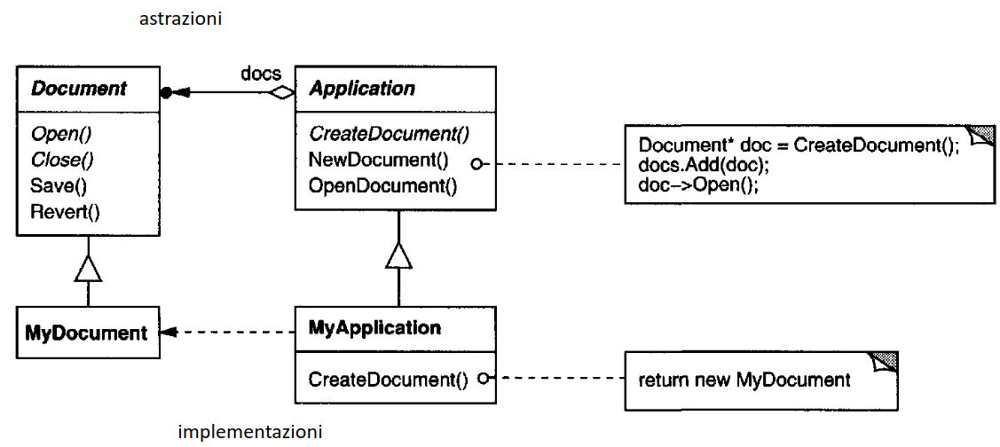

# Creazionale - Factory Method

- Si usa quando vogliamo definire un’interfaccia o una classe astratta per creare degli oggetti e delegare le sue sottoclassi a decidere quale classe istanziare quando viene richiesto un oggetto.
    - Utile quando una classe non può conoscere in anticipo la classe degli oggetti che deve creare.
## Esempio
- Consideriamo un framework per delle applicazioni ciascuna delle quali elabora documenti di diverso tipo.
    - Abbiamo bisogno di 2 astrazioni: la classe Application e la classe Document.
        - Application gestisce i documenti e li crea su richiesta dell’utente.
    - Entrambe le classi sono astratte e occorre definire delle loro sottoclassi per poter realizzare le implementazioni relative a ciascuna applicazione.
        - Ad esempio, per creare un’applicazione per disegnare, definiamo le classi DrawingApplication e DrawingDocument.
    - Definiamo un’interfaccia per creare un oggetto ma lasciamo alle sottoclassi decidere quali classi istanziare.
      - Poiché la particolare sottoclasse di Document da istanziare dipende dalla particolare applicazione, la classe Application non può fare previsioni riguardo alla sottoclasse di Document da istanziare.
      - La classe Application sa solo quando deve essere creato un nuovo documento ma non ne conosce il tipo.
      - **Problema**: devono essere istanziare delle classi ma si conoscono solo le classi astratte che non possono essere istanziate!
      - Il factory method pattern risolve questo problema incapsulando l’informazione riguardo alla sottoclasse di Document da creare e sposta questa informazione all’esterno del framework.
    
    
    
- Le sottoclassi di Application ridefiniscono il metodo astratto CreateDocument per restituire la sottoclasse appropriata di Document.
- Una volta istanziata, la sottoclasse di Application può creare istanze di Document per specifiche applicazioni senza dover conoscere le sottoclassi delle istanze create (CreateDocument).
- CreateDocument è detto factory method perché è responsabile della creazione degli oggetti.

### Esempio Dama

Voglio creare una scacchiera per la dama ed una per gli scacchi

```python
def main():
	checkers = CheckersBoard()
	print(checkers)

	chess = ChessBoard()
	print(chess)
```
- la scacchiera è una lista di liste (righe) di stringhe di un singolo carattere
- \_\_init__ inizializza la scacchiera con tutte le posizioni vuote.
  - poi invoca populate_board() per inserire i pezzi del gioco
  - supponiamo sia astratto...
- console() restituisce una stringa che rappresenta il pezzo ricevuto in input sul colore di sfondo passato come secondo argomento
```python
BLACK, WHITE = ("BLACK", "WHITE")

class AbstractBoard:

	def __init__(self, rows, columns):
	    self.board = [[None for _ in range(columns)] for _ in range(rows)]
	    self.populate_board()
	
	def populate_board(self):
	    raise NotImplementedError()
	
	def __str__(self):
	    squares = []
	    for y, row in enumerate(self.board):
	        for x, piece in enumerate(row):
	            square = console(piece, BLACK if (y + x) % 2 else WHITE)
	            squares.append(square)
	        squares.append("\\n")
	    return "".join(squares)

```

```python
class CheckersBoard(AbstractBoard):
    def __init__(self):
        super().__init__(10, 10)

    def populate_board(self):
        for x in range(0, 9, 2):
            for row in range(4):
                column = x + ((row + 1) % 2)
                self.board[row][column] = BlackDraught()
                self.board[row + 6][column] = WhiteDraught()

```

```python
class ChessBoard(AbstractBoard):
	def __init__(self):
		super().__init__(8,8)

	def populate_board(self):
		self.board[0][0] = BlackChessRook()
		self.board[0][1] = BlackChessKnight()
		# ... [inseriamo al loro posto tutte le singole figure] 
		self.board[7][7] = WhiteChessRook()

		for column in range(8): # inseriamo i pedoni
			self.board[1][column] = BlackChessPawn()
			self.board[6][column] = WhiteChessPawn()
```

- Definiamo ora la classe base per i pezzi
- Si è scelto di creare una classe che discende da str invece che usare direttamente str per poter facilmente testare se un oggetto z è un pezzo di gioco con isinstance (z, Piece)
- ponendo \_\_slots__ = () ci assicuriamo che gli oggetti di tipo Piece non abbiano valori di istanza.
```python
class Piece(str):
		__slots__ = () # ci assicuriamo che gli oggetti di tipo Piece non abbiano variabili di istanza
```

```python
class BlackDraught(Piece):
    __slots__ = ()

    def __new__(Class):
        return super().__new__(Class, "\\N{black draughts man}") # stiamo chiamando il costruttore della stringa

class WhiteChessKing(Piece):
    __slots__ = ()

    def __new__(Class):
        return super().__new__(Class, "\\N{white chess king}")
``` 

## Metodo alternativo per popolare la scacchiera di CheckersBoard.

- è un **factory method** in quanto dipende dalla factory function create_piece().
  - nella versione precedente, il tipo di pezzo era indicato dal codice
  - questa versione restituisce un oggetto del tipo appropriato in base ai suoi argomenti

```python
def populate_board(self):
	for x in range(0, 9, 2):
		for y in range(4):
			column = x + ((y+1) % 2)
			for row, color in ((y, "black"), (y+6, "white")):
				self.board[row][column] = create_piece("draught", color)

def create_piece(kind, color):
	if kind == "draught":
		return eval("{}{}()".format(color.title(), kind.title()))
	return eval("{}Chess{}()".format(color.title(), kind.title()))
```

## Ancora un nuovo Factory Method
- OSSERVARE ESCLUSIVAMENTE LA FUNZIONE populate_board() e create_piece()
```python
DRAUGHT, PAWN, ROOK, KNIGHT, BISHOP, KING, QUEEN = (
    "DRAUGHT", "PAWN", "ROOK", "KNIGHT", "BISHOP", "KING", "QUEEN"
)

BLACK, WHITE = "BLACK", "WHITE"

class AbstractBoard:
    __classForPiece = { (DRAUGHT, BLACK) : BlackDraught, 
                        (PAWN, BLACK) : BlackChessPawn},
                         # ... e tante altre casistiche
                        (QUEEN, WHITE) : WhiteChessQueen}
    
    def create_piece(self, kind, color):
        return AbstractBoard.__classForPiece[kind, color]()

    
class CheckersBoard(AbstractBoard):
    def __init__(self):
        super().__init__()
        self.board = [[None for _ in range(8)] for _ in range(8)]  # 8x8 board

    def create_piece(self, piece_type, color):
        """
        Crea un pezzo della dama con un determinato tipo e colore.
        """
        return {"type": piece_type, "color": color}

    def populate_board(self):
        """
        Popola la scacchiera con pezzi di dama. I pezzi neri si trovano nelle prime 3 righe,
        mentre i pezzi bianchi si trovano nelle ultime 3 righe.
        """
        for x in range(0, 8, 2):  # colonne alternate
            for y in range(3):  # prime 3 righe per i pezzi neri
                column = x + ((y + 1) % 2)  # shift alternato
                self.board[y][column] = self.create_piece(DRAUGHT, BLACK)
            for y in range(5, 8):  # ultime 3 righe per i pezzi bianchi
                column = x + ((y + 1) % 2)
                self.board[y][column] = self.create_piece(DRAUGHT, WHITE)

    def display_board(self):
        """
        Visualizza la scacchiera in console per il debugging.
        """
        for row in self.board:
            print(" ".join(str(cell) if cell else "." for cell in row))
>>> board = CheckersBoard()
>>> board.populate_board()
>>> board.display_board()
```

## create_piece senza uso di AbstractBoard.\_\_classForPiece
- ricerca direttamente la sottoclasse da utilizzare nel dizionario restituito da global()
```python
def create_piece(kind, color):
    color = "White" if color == WHITE else "Black"
    name = {DRAUGHT: "Draught", PAWN: "ChessPawn", ROOK: "ChessRook",
            KNIGHT: "ChessKnight", BISHOP: "ChessBishop", KING: "ChessKing", QUEEN: "ChessQueen"}[kind]
    return globals()[color + name]()
```