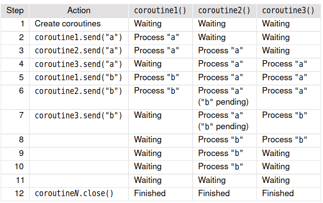

# Multitasking e Coroutine
## Coroutine e Concorrenza
- Per svolgere un insieme di operazioni indipendenti, un approccio può essere quello di effettuare un'operazione alla volta con lo svantaggio che se un'operazione è lenta, il programma deve attendere la fine di questa operazione prima di cominciare la prossima.
- Per risolvere questo problema, si possono usare le coroutine.
  - ciascuna operazione è una coroutine
  - un'operazione lenta non influenzerà le altre operazioni almeno fino al momento in cui queste non avranno bisogno di nuovi dati da elaborare. Ciò è dovuto al fatto che le operazioni vengono eseguite indipendentemente
<br><br>
- Supponiamo di avere 3 coroutine che elaborano gli stessi dati e impiegano tempi differenti
- La coroutine 1 è veloce, la coroutine 2 è lenta, la coroutine 3 impiega tempi variabili.
- Una volta che le tre coroutine hanno ricevuto i dati iniziali da elaborare, se una delle tre si trova a dover attendere perché ha finito per prima, le altre continuano a lavorare minimizzando gli idle time.
- Una volta che le coroutine non servono più, viene invocato close() su ciascuna coroutine in modo che non restino in attesa di altri dati e non utilizzino più tempo del processore.


### Un esempio
- Vogliamo applicare diverse espressioni regolari al testo in un insieme di file HTML.
- Lo scopo è dare in output le URL in ciascun file e gli heading di livello 1 e livello 2.
<br><br>
- URL_RE = re.compile(r"""href=(?P<quote>\['"])(?P<url>\[^\1]+?)""" r"""(?P=quote)""",
re.IGNORECASE)
- flags = re.MULTILINE|re.IGNORECASE|re.DOTALL
- H1_RE = re.compile(r"\<h1\>(?P\<h1>.+?)</h1>", flags)
- H2_RE = re.compile(r"\<h2>(?P\<h2>.+?)</h2>", flags)
-  Le espressioni regolari (regex) in alto servono a fare il match di una URL e del testo contenuto tra i tag \<h1> e \<h2>.
-  Ciascun regex_matcher() è una coroutine che prende una funzione
receiver (anch’essa una coroutine) e un regex
- Ogni volta che il matcher ottiene un match lo invia al receiver.
```python
receiver = reporter()
matchers = (regex_matcher(receiver, URL_RE),
    regex_matcher(receiver, H1_RE),
    regex_matcher(receiver, H2_RE))
```
<br><br>
- Il matcher entra in un loop infinito e subito si mette in attesa che yield restituisca un testo a cui applicare il regex.
- Una volta ricevuto il testo, il matcher itera su ogni match ottenuto, inviando ciascun match al receiver.
- Una volta terminato il matching la coroutine torna a yield e si sospende nuovamente in attesa di altro testo.
```python
@coroutine
def regex_matcher(receiver, regex):
    while True:
        text = (yield)
        for match in regex.finditer(text):
            receiver.send(match)
```
- Il programma legge i nomi dei file sulla linea di comando e per ciascuno di essi stampa il nome del file e poi salva l’intero testo del file nella variabile html usando la codifica UTF-8.
- Il programma itera su tutti i matcher e invia il testo ad ognuno di essi.
- Ogni matcher procede indipendentemente inviando ogni match ottenuto alla coroutine reporter
- Alla fine viene invocato close() su ciascun matcher e sul reporter per impedire che i matcher rimangano sospesi in attesa di testo e che il reporter rimanga in attesa di match.
```python
try:
    for file in sys.argv[1:]:
        print(file)
        html = open(file, encoding="utf8").read()
        for matcher in matchers:
            matcher.send(html)
    finally:
        for matcher in matchers:
            matcher.close()
        receiver.close() 
```

- La Coroutine reporter() è usata per dare in output i risultati.
- Viene creata dallo statement receiver = reporter() ed è passata ad ogni matcher come argomento receiver.
- Il reporter() attende che gli venga spedito un match, quindi stampa i dettagli del match e poi continua ad attendere in un loop infinito fino a quando viene invocato close() su di esso.
```python
@coroutine
def reporter():
    ignore = frozenset({"style.css", "favicon.png", "index.html"})
    while True:
        match = (yield)
        if match is not None:
            groups = match.groupdict()
            if "url" in groups and groups["url"] not in ignore:
                print(" URL:", groups["url"])
            elif "h1" in groups:
                print(" H1: ", groups["h1"])
            elif "h2" in groups:
                print(" H2: ", groups["h2"])
```
**Nota**: re.Match.groupdict() restituisce un dizionario contenente tutti sottogruppi con nome del match e associa come chiave a ciascun sottogruppo il nome del sottogruppo.