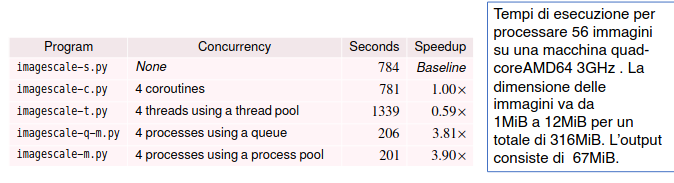
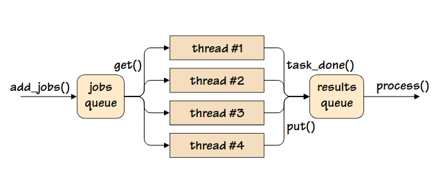

# Concorrenza
## Tipi di concorrenza e dati condivisi
- I diversi modi di implementare la concorrenza si differenziano principalmente per il modo in cui vengono condivisi i dati:
  - accesso diretto ai dati condivisi, ad esempio attraverso la memoria condivisa
  - accesso indiretto, ad esempio, usando la comunicazione tra processi (IPC)
- La concorrenza a thread consiste nell'avere thread concorrenti separati che operano all'interno di uno stesso processo. Questi thread tipicamente accedono i dati condivisi attraverso un accesso serializzato alla memoria condivisa realizzato dal programmatore mediante un meccanismo di locking.
- La concorrenza basata sui processi (multiprocessing) si ha quando processi separati vengono eseguiti indipendentemente. I processi concorrenti tipicamente condividono i dati mediante IPC anche se possono usare anche la memoria condivisa se il linguaggio o la libreria lo supportano.
### Concorrenza in Python
- Python supporta sia la concorrenza basata sui thread che quella sui processi
  - L'approccio ai threading è alquanto convenzionale
  - L'approccio multiprocessing è molto più ad alto livello di quello fornito da altri linguaggi. Il supporto al multiprocessing utilizza le stesse astrazioni del threading per facilitare il passaggio tra i due approcci, almeno quando non viene usata memoria condivisa.

## Problematiche legate a GIL
- Il Python Global Interpreter Lock (GIL) impedisce al codice di essere eseguito su più di un core alla volta
  - Si tratta di un lock che permette ad un solo thread di avere il controllo dell'interprete Python
- Il GIL ha generato il mito che in Python non si può usare il multithreading o avere vantaggio da un'architettura multi-core

## Concorrenza
- se la computazione è CPU-bound, l'uso del threading può facilmente portare a performance peggiori rispetto a quelle in cui non si fa uso della concorrenza.
  - Una soluzione consiste nell'usare Cython che è essenzialmente Python con dei costrutti sintattici aggiuntivi che vengono compilati in puro C. Ciò può portare a performance 100 volte migliori più spesso di quanto accada usando qualsiasi tipo di concorrenza in cui le performance dipendono dal numero di processori usati.
  - Se la concorrenza è invece la scelta più appropriata allora per evitare il GIL sarà meglio usare il modulo per il multiprocessing. Se usiamo il multiprocessing invece di usare thread separati nello stesso processo che quindi si contendono il GIL abbiamo processi separati che usano ciascuno la propria istanza dell'interprete Python senza bisogno di competere tra di loro.
- se la computazione è I/O-bound, come a esempio nelle reti, usare la concorrenza può portare a miglioramenti delle performance molto significativi.
  - In questi casi i tempi di latenza della rete sono un tale fattore dominante che non ha importanza quale tipo di concorrenza utilizziamo
<br<br>
- È raccomandabile scrivere la prima versione non concorrente del programma, se possibile
- il programma non concorrente è più semplice da scrivere e testare.
- Solo nel caso non fosse sufficientemente veloce, si potrebbe scrivere la versione concorrente per fare un confronto in termini di performance.
- La raccomandazione è di usare il multiprocessing nel caso di computazione CPU-bound e uno qualsiasi tra multiprocessing e threading nel caso di I/O-bound.
- Oltre al tipo di concorrenza, è importante anche il **livello** di concorrenza.

### Livelli di Concorrenza
- Low-Level Concurrency: A questo livello di concorrenza si fa uso esplicito di operazioni atomiche.
  - Questo tipo di concorrenza è più adatta a scrivere librerie che a sviluppare applicazioni, in quanto può portare ad errori e rende difficile il debugging. Python non supporta questo livello di concorrenza anche se in esso la concorrenza è tipicamente implementata con operazioni di basso livello.
- Mid-Level Concurrency: Questo tipo di concorrenza non fa uso di operazioni atomiche esplicite ma fa uso di lock espliciti. Questo è il livello di concorrenza supportato dalla maggior parte dei linguaggi. Python fornisce il supporto per questo livello di concorrenza con classi quali threading.Semaphore, threading.Lock e multiprocessing.Lock. Questo livello di concorrenza è spesso usato per lo sviluppo di applicazioni perché spesso è l’unico disponibile
- High-Level Concurrency: Questo livello di concorrenza non fa uso né di operazioni atomiche esplicite né di lock espliciti. Alcuni linguaggi stanno cominciando a supportare questo tipo di concorrenza. Python fornisce il modulo concurrent.futures e le classi queue.Queue, multiprocessing.queue o multiprocessing.JoinableQueue per supportare la concorrenza ad alto livello.

### Dati modificabili condivisi
- Il problema è la condivisione dei dati
  - Dati modificabili (mutable) condivisi devono essere protetti da lock per assicurare che tutti gli accessi siano serializzati in modo che un solo thread o processo alla volta possa accedere ai dati condivisi
  - Quando thread o processi multipli provano ad accedere agli stessi dati condivisi allora tutti ad eccezione di uno vengono bloccati. Ciò significa che quando viene posto un lock, la nostra applicazione può usare un unico thread o processo come se fosse non concorrente. Di conseguenza, è bene usare i lock il meno possibile e per il più breve tempo possibile.
<br><br>
- la soluzione più semplice consisterebbe nel non condividere dati modificabili. In questo modo non vi sarebbe bisogno di lock espliciti e non vi sarebbero problemi di concorrenza.
- A volte, thread o processi multipli hanno bisogno di accedere agli stessi dati ma ciò può essere risolto senza lock espliciti.
  - Una soluzione consiste nell'usare una struttura dati che supporta l'accesso concorrente. Il modulo queue fornisce diverse code thread-safe. Per la concorrenza basata sul multiprocessing possiamo usare le classi multiprocessing.JoinableQueue e multiprocessing.Queue
    - Le code forniscono una singola sorgente di job per tutti i thread e tutti i processi, e una singola destinazione dei risultati.
  - Alternative: dati non modificabili, deep copy dei dati e, per il multiprocessing, tipi che supportano l'accesso concorrente, come multiprocessing.Value per un singolo valore modificabile o multiprocessing. Array per un array di valori modificabili.

## Informazioni sul pacchetto multiprocessing
- Un oggetto multiprocessing.Process rappresenta un'attività che è svolta in un processo separato. I metodi principali della classe sono:
  - run(): metodo che rappresenta l'attività del processo
    - può essere sovrascritto. Il metodo standard invoca l'oggetto callable passato al costruttore di Process con gli argomenti presi dagli argomenti di args e kwargs, passati anch'essi al costruttore.
  - start(): metodo che dà inizio all'attività del processo
    - Deve essere invocato al più una volta per un oggetto processo.
    - Fa in modo che il metodo run() dell'oggetto venga invocato in un processo separato.
  - join(timeout): se l'argometno opzionale timeout è None, il metodo si blocca fino a quando l'oggetto processo il cui metodo join() è stato invocato non termina. Se timeout è un numero positivo, join si blocca per al più timeout secondi. Il metodo restituisce None se il processo termina o se scade il tempo indicato da timeout.
    - Il metodo può essere invocato più volte per uno stesso oggetto processo
    - Un processo non può invocare join() su se stesso in quanto ciò provocherebbe un deadlock
  - multiprocessing.Process(group=None, target=None, name=None, args=(), kwargs={}, *, daemon=None) deve essere sempre invocato con argomenti keyword:
    - group deve essere sempre None in quanto è presente solo per ragioni di compatibilità con threading.Thread di cui multiprocessing.Process condivide l’interfaccia
    - target è l’oggetto callable invocato da run(). Se è None vuol dire che non viene invocato alcun metodo
    - name è il nome del processo
    - args è la tupla di argomenti da passare a target
    - kwargs è un dizionario di argomenti keyword da passare a target
    - daemon serve a settare il flag daemon a True o False. Il valore di default è None. Se daemon è None il valore del flag daemon è ereditato dal processo che invoca il costruttore.
    per default non vengono passati argomenti a target.
<br><br>
- I due metodi più usati per dare inizio ad un processo sono i seguenti:
  - spawn: Il processo padre lancia un nuovo processo per eseguire l’interprete python. Il processo figlio erediterà solo le risorse necessarie per eseguire il metodo run(). Questo modo di iniziare i processi è molto lento se confrontato con fork
    - spawn è disponibile sia su Unix che Windows. È il default su Windows
  - fork: Il processo padre usa os.fork() per fare il fork dell’interprete Python. Il processo figlio in questo caso è effettivamente identico al padre. Tutte le risorse sono ereditate dal padre.
    - Disponibile solo su Unix dove rappresenta il medodo di default per iniziare i processi.
  - **multiprocessing.Queue([maxsize])**
    - restituisce una coda condivisa da processi
    - maxsize è opzionale e serve a limitare il numero massimo di elementi che possono essere inseriti
    - Queue.qsize(): restituisce la dimensione approssimata della coda. Questo numero non è attendibile per via della semantica del multithreading/multiprocessing.
    - Queue.empty(): restituisce True se la coda è vuota; False altrimenti. Anche l’output di questo metodo non è attendibile.
    - Queue.full(): restituisce True se la coda è piena; False altrimenti. Anche l’output di questo metodo non è attendibile.
    - Queue.put(obj, block, timeout): inserisce obj nella coda. Se l’argomento opzionale block è True
(default) e timeout è None (default), si blocca fino a che non si rende disponibile uno
slot. Se timeout è un numero positivo, si blocca per al più timeout secondi e lancia
l’eccezione queue.Full se non si rende disponibile nessuno slot entro quel lasso di
tempo. Se block è falso, l’elemento viene inserito se è immediatamente disponibile uno
slot altrimenti viene subito lanciata queue.Full (timeout viene ignorato).
    - Queue.put_nowait(obj): equivalente a put(obj, False)
    - Queue.get(block, timeout): rimuove e restitusce un elemento dalla coda. Se l’argomento
opzionale block è True (default) e Timeout è None (default), si blocca fino a che un
elemento è disponibile. Se timeout è un numero positivo si blocca per al più timeout
secondi e lancia l’eccezione queue.Empty se nessun elemento si è reso disponibile in
quel lasso di tempo. Se block è falso, viene restituito un elemento se ce ne è uno
immediatamente disponibile, altrimenti viene subito lanciata queue.Empty (timeout
viene ignorato).
    - Queue.get_nowait(): equivalente a get(False).
  - **multiprocessing.JoinableQueue**
    - JoinableQueue è una sottoclasse di Queue che ha in aggiunta i metodi task_done() e join().
    - JoinableQueue.task_done() indica che un task precedentemente inserito in coda è stato completato. Questo
metodo è usato dai fruitori della coda.
      - Per ciascuna get() usata per prelevare un task, deve essere effettuata una successiva
chiamata a task_done per informare la coda che il task è stato completato.
      - Un join() bloccato si sblocca quando tutti i task sono stati completati e cioè dopo che è stata
ricevuta una chiamata a task_done() per ogni item precedentemente inserito in coda.
      - Si ha un ValueError se task_done() è invocato un numero di volte maggiore degli elementi in
coda.
    - JoinableQueue.join() causa un blocco fino a quando gli elementi nella coda non sono stati tutti prelevati e
processati.
      - Il conteggio dei task incompleti è incrementato ogni volta che viene aggiunto un elemento
alla coda e viene decrementato ogni volta che un fruitore della coda invoca task_done() (se
task_done() non fosse invocato ogni volta si potrebbe avere un overflow nel conteggio).
      - Quando il conteggio dei task va a zero, join() si sblocca.

# Esempio
- Supponiamo di voler scalare un insieme di immagini e di volerlo fare quanto più velocemente possibile usando più core
- Scalare immagini è CPU-Bount e quindi ci si aspetta migliori performance dal multiprocessing

- Il programma per scalare immagini accetta i seguenti argomenti dalla linea di comando:
  - la dimensione su cui scalare le immagini
  - opzione se scalare o meno in modo smooth
  - directory delle immagini sorgente
  - directory delle immagini ottenute
- Immagini più piccole della dimensione indicata vengono copiate invece che scalate
- Per le versioni concorrenti è anche possibile specificare la concorrenza (quanti thread o processi usare)
  - per i programmi CPU-bound, normalmente usiamo tanti thread o processi quanti sono i core
  - per i progammi I/O-bound, usiamo un certo multiplo del numero di core (2x, 3x, 4x..) in base alla larghezza della banda della rete
- La tupla di nome Result memorizza il conteggio di quante immagini sono state copiate e quante scalate che può essere (1,0) o (0, 1) e il nome dell'immagine creta
- La tupla di nome Summary è usata per immagazzinare una sintesi di tutti i risultati.

```python
Result = collections.namedtuple("Result", "copied scaled name")
Summary = collections.namedtuple("Summary", "todo copied scaled canceled")
```
    
- collections.namedtuple(typename, field_names, *, rename=False, defaults=None, module=None) restituisce una nuova sottoclasse di tuple di nome typename
  - field_names è una sequenza di stringhe come ['x', 'y’] o può essere una singola stringa con ciascun nome separato da uno spazio e/o una virgola, come ad esempio 'x y’ oppure 'x, y’.   
    - per i nomi dei campi possono essere usati quelli ammessi per gli identificatori, ad eccezione dei nomi che iniziano con '_'
  - La nuova sottoclasse è usata per creare tuple i cui campi sono accessibili come attributi, oltre ad
essere indicizzabili e iterabili.
  - Le istanze della sottoclasse hanno anche una docstring con typename e field_names e un utile
metodo __repr__() che elenca il contenuto della tupla in formato name=value.
  - Per gli altri argomenti si veda la documentazione.
- La funzione main legge la linea di comando con handle_commandline() che restituisce
  - la dimensione a cui occorre scalare l'immagine
  - un Booleano che indica se occorre usare uno scaling smooth
  - la directory sorgente da cui leggere le immagini
  - la directory destinazione dove scrivere le immagini ottenute
  - per le versioni concorrenti, il numero di thread o processori da utilizzare che per default è il numero di core.
- La funzione main riporta all'utente (con la funzione Qtrac.report()) che sta oer eseguire la funzione scale() che è la funzione che svolge tutto il lavoro
- Quando la funzione scale() restituisce la sintesi dei risultati, questa viene stampata usando la funzione summarize()
- scale() è il cuore del programma concorrente basato sulla coda.
  - la funzione comincia creando una coda joinable di job da eseguire ed una coda non joinable di risultati
  - poi crea i processi per svolgere il lavoro e aggiunge job alla coda dei job con add_jobs()
```python
def main():
    size, smooth, source, target, concurrency = handle_commandline()
    Qtrac.report("starting...")
    summary = scale(size, smooth, source, target, concurrency)
    summarize(summary, concurrency)

def scale(size, smooth, source, target, concurrency):
    canceled = False
    jobs = multiprocessing.JoinableQueue()
    results = multiprocessing.Queue()
    create_processes(size, smooth, jobs, results, concurrency)
    todo = add_jobs(source, target, jobs)
    try:
        jobs.join() ## oltre questa riga, riferimento alla spiegazione sotto
    except KeyboardInterrupt: # May not work on Windows
        Qtrac.report("canceling...")
        canceled = True
    copied = scaled = 0
    while not results.empty(): # Safe because all jobs have finished
        result = results.get_nowait()
        copied += result.copied
        scaled += result.scaled
    return Summary(todo, copied, scaled, canceled)
```
- Con tutti i job nella coda, si aspetta che la coda dei job diventi vuota usando il metodo multiprocessing.JoinableQueue.join()
  - Ciò avviene in un blocco try...except in modo che se l'utente cancella l'esecuzione (con CTRL+C) possiamo gestire la cancellazione
- Quando i job sono stati tutti eseguiti o il programma è stato cancellato, iteriamo sulla coda dei risultati
  - Di solito, usare il metodo empty() su una coda concorrente non è affidabile ma qui funzione bene siccome tutti i processi worker sono terminati e la coda non viene più aggiornata
  - Per questo stesso motivo possiamo usare il metodo multiprocessing.Queue.get_nowait() che non blocca gli altri processi invece del metodo multiprocessing.Queue.get() che invece blocca gli altri processi
- Una volta accumulati i risultati, la tupla Summary viene restituita
  - In un'esecuzione normale, nella tupla Summary restituita, il valore todo è uguale alla somma di copied e scales e cancelled è False;
  - per un'esecuzione cancellata, todo è probabilmente maggiore di copied+scaled e cancelled è True
<br><br>
- Questa funzione (sotto) crea i processi per svolgere il lavoro.
- I processi ricevono la stessa funzione worker() (in quanto fanno tutti lo stesso lavoro) e i dettagli
del lavoro che devono svolgere.
- Ciò include la coda dei job condivisi e la coda dei risultati. Di norma non occorre mettere un
lock a queste code condivise dal momento che le code stesse si occupano della loro sincronizzazione
```python
def create_processes(size, smooth, jobs, results, concurrency):
    for _ in range(concurrency):
        process = multiprocessing.Process(target=worker, args=(size, smooth, jobs, results))
    process.daemon = True
    process.start()
```
- Una volta creato un processo, esso viene trasformato in daemon in modo che termini nel
momento in cui termina il processo principale. I processi non daemon continuano ad essere
eseguiti anche una volta che è terminato il processo principale e su Unix diventano zombie.
- Dopo aver creato ciascun processo e averlo trasformato in daemon gli viene indicato di
cominciare a svolgere la funzione che gli è stata assegnata. A quel punto ovviamente il daemon si
blocca in quanto non abbiamo ancora inserito alcun job nella coda dei job.
  - Ciò non è importante dal momento che il blocco avviene in un processo separato e non
blocca il processo principale. Di conseguenza, tutti i processi vengono creati velocemente e
poi la funzione termina. Poi aggiungiamo job alla coda dei job per permettere ai processi
bloccati di lavorare per eseguire questi job.
<br><br>
- Il codice proposto crea una funzione (worker) che viene passata come argomento (target) a multiprocessing.Process
- La funzione worker esegue un loop infinito e in ogni iterazione prova a recuperar un job da svolgere dalla coda dei job condivisi. È safe utilizzare un loop infinito in quanto il processo è un daemon e quindi terminerà al termine del programma
```python
def worker(size, smooth, jobs, results):
    while True:
        try:
            sourceImage, targetImage = jobs.get()
            try:
                result = scale_one(size, smooth, sourceImage, targetImage)
                Qtrac.report("{}{}".format("copied" if result.copied else "scaled", os.path.basename(result.name)))
                result.put(result)
            except Image.Error as err:
                Qtrac.report(str(err), True)
        finally:
            jobs.task_done()
```
- Il metodo multiprocessing.get() si blocca fino a che non è in grado di restituire un job che in questo
esempio è una tupla di due elementi, il nome dell’immagine sorgente e il nome dell’immagine target.
- Una volta recuperato il job, viene effettuato lo scale usando la funzione scale_one() e viene riportato
ciò che è stato fatto. Viene anche inserito il risultato nella coda condivisa dei risultati

<br><br>
- Una volta che sono stati creati e iniziati i processi, essi sono tutti bloccati nell’attesa di riuscire a
prelevare job dalla coda dei job condivisi
- Per ogni immagine da elaborare, questa funzione crea due stringhe: sourceImage che contiene l’intero
percorso dell’immagine sorgente e targetImage che contiene l’intero percorso dell’immagine
destinazione.
- Ciascuna coppia di questi percorsi è aggiunta come tupla alla coda dei job. Alla fine la funzione
restituisce il numero totale di job che devono essere svolti.
- Non appena il primo job è aggiunto alla coda, uno dei processi worker bloccati lo preleva e comincia a
svolgerlo. La stessa cosa avviene per gli altri job inseriti fino a quando tutti i worker acquisiscono un job
da svolgere. Più in là , è probabile che altri job vengano inseriti in coda mentre i processi worker stanno
lavorando sui job prelevati. Questi nuovi job saranno prelevati non appena i worker fiscono di svolgere
i job prelevati in precedenza. Quando i job nella coda terminano, i worker si bloccano in attesa di nuovo lavoro.

<br><br>
- Questa funzione è dove viene effettuato veramente lo scaling
- Essa usa un modulo cyImage o il modulo Image se cyImage non è disponibile
- Se l'immagine è già più piccola della dimensione data allora l'immagine viene semplicemente salvata nel file la cui path è specificata da targetImage. Viene quindi restituito Result per indicare che un'immagine è stata copiata e che nessuna è stata scalata per specificare il file dell'immagine target
- Altrimenti l'immagine è scalata e l'immagine risultante salvata. In questo caso il risultato Result informa che nessuna immagine è stata salvata e che una è stata scalata e indica il file dell'immagine target

```python
def scale_one(size, smooth, sourceImage, targetImage):
  oldImage = Image.from_file(sourceImage)
  if oldImage.width <= size and oldImage.height <= size:
    oldImage.save(targetImage)
    return Result(1, 0, targetImage)
  else:
    if smooth:
        scale = min(size / oldImage.width, size / oldImage.height)
        newImage = oldImage.scale(scale)
    else:
        stride = int(math.ceil(max(oldImage.width / size, oldImage.height / size)))
        newImage = oldImage.subsample(stride)
    newImage.save(targetImage)
    return Result(0, 1, targetImage)
```

<br><br>
- Una volta che tutte le immagini sono state processate, la funzione scale() crea e restituisce una Summary che nel main viene passato alla funzione summarize
```python
def summarize(summary, concurrency):
  message = "copied {} scaled {} ".format(summary.copied, summary.scaled)
  difference = summary.todo - (summary.copied + summary.scaled)
  if difference:
      message += "skipped {} ".format(difference)
  message += "using {} processes".format(concurrency)
  if summary.canceled:
        message += " [canceled]"
  Qtrac.report(message)
  print()
```
- Una tipica sintesi prodotta da summarize è mostrata nella seguente figura
- ```copied 0 scaled 56 using 4 processes```

## modulo concurrent.futures
- Il modulo concurrent.futures fornisce un'interfaccia per eseguire callable in modo asincrono.
- L'esecuzione asincrona può essere svolta con thread, usando ThreadPoolExecutor o con processi separati usando ProcessPoolExecutor. Entrambe le classi estendono la classe astratta Execupor
- concurrent.futures.Future è un oggetto che incapsula l'esecuzione asincrona di un callable
- oggetti Future sono creati invocando concurrent.futures.Executor.submit()
- la classe concurrent.futures.Executor non può essere usata direttamente perché è una classe astratta. Al suo posto devono essere usate le sue due seguenti sottoclassi concrete.
  - concurrent.futures.ProcessPoolExecutor realizza la concorrenza usando processi multipli
  - concurrent.futures.ThreadPoolExecutor realizza la concorrenza con thread multipli
  - concurrent.futures.Executor.submit(fn, *args, **kwargs) fa in modo che il callable fn venga eseguito come fn(*args, **kwargs) e restituisce un oggetto Future che rappresenta l'esecuzione del callable
  - concurrent.futures.Future.cancel() prova a cancellare l'invocazione del callable. Se l'invocazione è già terminata o è già stata cancellata allora il metodo restituisce False; in caso contrario la chiamata viene cancellata e il metodo restituisce True.
  - concurrent.futures.as_completed(fs, timeout=None) restituisce un iteratore su istanze di Future fornite da fs.
- Le istanze di Future vengono fornite non appena vengono completate.
  - Le istanze di future potrebbero anche essere state create da differenti istanze di executor
- Se un future fornito da fs è duplicato, questo viene restituito un'unica volta dall'iteratore
- I future completati prima che as_completed() venga invocato, vengono restituiti per primi.
- L'iteratore restituito lancia concurrent.future.TimeoutError se dopo aver invocato \_\_next__() il risultato non è disponibile entro timeout secondi dall'invocazione di as_completed(). Timeout può essere un int o float. Se Timeout non è specificato, non c'è limite di attesa.

# Esempio di Multiprocessing con uso di Futures
- Questa funzione esegue lo stesso lavoro della funzione scale() dell'implementazione precedente ma lo fa in modo completamente diverso.
- La funzione comincia creando un insieme vuoto di future.
- Poi crea l'oggeto ProcessPoolExecutor che dietro le scene creerà un numero di processi worker.
  - Il numero esatto per max_workers è determinato da un'euristica ma qui il numero è fissato.
```python
def scale(size, smooth, source, target, concurrency):
  futures = set()
  with concurrent.futures.ProcessPoolExecutor(max_workers=concurrency) as executor:
    for sourceImage, targetImage in get_jobs(source, target):
        future = executor.submit(scale_one, size, smooth, sourceImage, targetImage)
        futures.add(future)
    
    summary = wait_for(futures)
    
    if summary.canceled:
        executor.shutdown()
  
    return summary
```
- Una volta che ha creato un oggetto ProcessPoolExecutor, scale() itera sui job restituiti da
get_jobs() e crea per ciascuno di essi un future.
- Il metodo concurrent.futures.ProcessPoolExecutor.submit() accetta una funzione worker e
argomenti opzionali e restituisce un oggetto Future.
- Il pool comincia a lavorare non appena ha un future su cui lavorare. Quando tutti i future sono
stati creati, viene chiamata una funzione wait_for() passandole l’insieme di future. Questa
funzione si bloccherà fino a quando tutti i future sono stati eseguiti o cancellati dall’utente. Se
l’utente cancella, la funzione dismette il pool executor invocando shutdown().
------
shutdown(wait=True, *, cancel_futures=False)) segnala all’executor che deve liberare tute le
risorse che sta impegnando, non appena i future ancora in esecuzione terminano la loro
esecuzione.
- Le successive invocazioni di Executor.submit() lanciano RuntimeError.
- Se wait è True allora questo metodo non termina fino a che non termina l’esecuzione di tutti
i future. Se wait è False allora questo metodo termina immediatamente e le risorse associate
all’executor vengono liberate quando tutti i future hanno terminato la propria execuzione.
- A prescindere dal valore di wait, non si esce dall’intero programma Python fino a quando
non termina l’esecuzione di tutti future.
- se cancel_futures=True allora vengono cancellati tutti i future la cui esecuzione non è ancora
iniziata.
- Si può evitare di invocare shutdown esplicitamente se si si usa lo statement with. Lo
statement with effettuerà lo shutdown dell’oggetto Executor con le stesse modalità con cui
viene effettuato da Executor.shutdown() quando è invocato con wait = True
---
- Implementazioni delle sub_funzioni usate in scale() [il codice sopra]
```python
# svolge lo stesso compito di add_jobs() solo che qui è un'implementazione generatore che restituisce job su richiesta
def get_jobs(source, target):
    for name in os.listdir(source):
        yield os.path.join(source, name), os.path.join(target, name)
```
```python
def wait_for(futures):
    # La funzione `wait_for()` viene invocata per aspettare che i future vengano completati.
    canceled = False
    copied = scaled = 0
    try:
        # Il ciclo for utilizza `concurrent.futures.as_completed()` che:
        # - Si blocca fino a quando un future non viene completato o cancellato.
        # - Restituisce il future completato o cancellato.
        for future in concurrent.futures.as_completed(futures):
            # Controlla se il callable worker lanciato dal future ha generato un'eccezione.
            err = future.exception()
            if err is None:
                # Nessuna eccezione: recupera il risultato del future.
                result = future.result()
                # Aggiorna i conteggi di copie e ridimensionamenti.
                copied += result.copied
                scaled += result.scaled
                # Riporta il progresso all'utente indicando il tipo di operazione (copia o ridimensionamento).
                Qtrac.report(
                    "{} {}".format(
                        "copied" if result.copied else "scaled", 
                        os.path.basename(result.name)
                    )
                )
            elif isinstance(err, Image.Error):
                # Se si verifica un'eccezione prevedibile (proveniente dal modulo `image`), 
                # viene riportata all'utente.
                Qtrac.report(str(err), True)
            else:
                # Se si verifica un'eccezione inattesa (non derivante da `Image.Error`),
                # viene lanciata nuovamente poiché potrebbe essere un errore logico del programma.
                raise err
    except KeyboardInterrupt:
        # Se l'utente interrompe l'esecuzione con Ctrl+C, si segnala l'interruzione...
        Qtrac.report("canceling...")
        canceled = True
        # ... e si cancellano i future uno alla volta.
        for future in futures:
            future.cancel()
    # Restituisce un riepilogo con il numero totale di future, conteggio di copie, ridimensionamenti
    # e stato di cancellazione.
    return Summary(len(futures), copied, scaled, canceled)

```

# Concorrenza I/O Bound
## Esempio
- Scaricare file o pagine web da Internet è un'esigenza molto frequente. A causa dei tempi di latenze della rete, è di solito possibile fare molti download in modo concorrente e quindi terminare molto più velocemente il download.
- Il libro Summerfield propone un codice che scarica RSS feed (piccoli documneti XML) che riportano storie relative a notizie riguardanti il mondo della tecnologia.
- I feed provengono da diversi siti web e il programma li usa per produrre una singola pagina HTML con i link a tutte le storie.
- Poiché la latenza della rete varia molto, la velocità dei programmi può variare molto da un minimo di 2 fino a un massimo di 10 o più volte, in base ai siti, la quantità di dati da scaricare e la banda della connessione.
- In considerazione di ciò, le differenze tra la versione basata su multiprocessing e quella basata su multithreading sono insignificanti.
- La cosa importante da ricordare è che l'approccio concorrente permette di raggiungere velocità molto più elevate nonostante queste varino di esecuzione in esecuzione.

### Informazioni sul pacchetto threading
- Il modulo threading costituisce interfacce a più alto livello per il threading al di sopra del modulo di basso livello _thread.
- La classe Thread rappresenta un'attività che viene eseguita in un thread separato.
- Una volta creato un oggetto thread, il thread viene considerato vivo fino al momento in cui non termina il suo metodo run() (anche se a causa di un'eccezione non gestita)

- Altri thread possono invocare il metodo join() di un thread. Ciò blocca il thread che invoca join() fino a quando non termina il thread il cui metodo join() è stato invocato.
- Il thread ha un attributo name il cui valore può essere passato al costruttore e letto o modificato attraverso l'attributo name.
- I thread possono essere contrassegnati come daemon attraverso un flag. Se vi sono solo thread daemon in esecuzione, si esce dall'intero programma. Il valore iniziale del flag è ereditato dal thread che crea il thread o può essere passato al costruttore.
- L'interfaccia di threading.Thread forntia è simile a quella di multiprocessing.Process.

## Ritorniamo all'esempio con code e threading
- Questo esempio usa thread multipli e due code thread-safe, una per i job (URL) e l'altra per i risultati (coppie contenenti True e un frammento HTML da includere nella pagina HTML da costruire, oppure False e un messaggio di errore)
- La funzione main() comincia ricevendo dalla linea di comando il massimo numero di elementi (limit) da leggere da una data URL e un livello di concorrenza (concurrency)
  - La funzione handle_commandline() pone il valore della concorrenza pari a 4 volte il numero di core

```python
def main():
  limit, concurrency = handle_commandline()
  Qtrac.report("starting...")
  filename = os.path.join(os.path.dirname(__file__), "whatsnew.dat")
  jobs = queue.Queue()
  results = queue.Queue()
  create_threads(limit, jobs, results, concurrency)
  todo = add_jobs(filename, jobs)
  process(todo, jobs, results, concurrency)
```
---
- queue implementa code che possono essere utilizzate da più Entità.
- Sono particolarmente utili nel multithreading in quanto consentono a thread multipli di scambiarsi informazioni in modo sicuro.
- Il modulo implementa tre tipi di code: FIFO, LIFO e Code a priorità.
- Internamente queste code usano lock per bloccare temporaneamente thread in competizione tra loro.
---
- La funzione poi riporta all'utente che sta cominciando a lavorare e mette in filename l'intero percorso del file di dati contenente le URL
- Poi la funzione crea due code thread-safe e i thread worker.
- Una volta iniziati i thread worker (che sono bloccati perché non c'è alcun lavoro da svolgere ancora) vengono aggiunti i job alla coda dei job
- Si attende quindi nella funzione process() che i job vengano completati e poi vengono forniti in output i risultati
---
- Questa funzione crea un numero di thread worker pari al valore specificato da
concurrency e da` a ciascuno di questi thread una funzione worker da eseguire e
gli argomenti con cui la funzione deve essere invocata.
- Ciascun thread viene trasformato in thread daemon in modo che venga terminato al termine del programma
- Alla fine viene invocato start sul thread che si bloccherà in attesa di un job. In questa attesa sono solo i thread worker a essere bloccati non il thread principale
```python
def create_threads(limit, jobs, results, concurrency):
  for _ in range(concurrency):
    thread = threading.Thread(target=worker, args=(limit, jobs, results))
    thread.daemon = True
    thread.start()
```


---
- La funzione Feed.iter() restituisce ciascun feed come una coppia (title, url) che viene aggiunta alla coda jobs. Alla fine viene restituito il numero di job.
- In queste caso la funzione avrebbe potuto restituire lo stesso valore invocando jobs.qsize() piuttosto che computare direttamente il numero di job. Se però add_jobs() fosse stato eseguito nel suo proprio thread allora il valore restituto da qsize() non sarebbe stato attendibile dal momento che i job sarebbero stati prelevati nello stesso momento in cui vengono aggiunti.
```python
def add_jobs(filename, jobs):
  for todo, feed in enumerate(Feed.iter(filename), start=1):
    jobs.put(feed)
  return todo
```
---
- La funzione worker esegue un loop infinito. Termina sicuramente al termine del programma dal momento che il thread è un daemon.
- La funzione si blocca in attesa di prendere un job dalla coda dei job e non appena prende un job usa la funzione Feed.read() [dal modulo Feed.py] per leggere il file identificato dalla URL
  - La funzione Feed.read() legge una
data URL (feed) e tenta di farne il
parsing. Se il parsing ha successo, la
funzione restituisce True insieme ad
una lista di frammenti HTML.
Altrimenti, restituisce False insieme
a None o a un messaggio di errore.
- Se la read fallisce, il flag ok è False e viene stampato il risultato che è un messaggio di errore. Altrimenti, sempre che il programma ottenga un risultato (lista di stringhe HTML), viene stampato il primo elemento (privo di tag HTML) e aggiunto il risultato alla coda dei risultati.
- Il blocco try...finally garantisce che jobs.task_done() venga invocato ogni volta che viene invocato queue.Queue.get() call

```python
def worker(limit, jobs, results):
  while True:
    try:
      feed = jobs.get()
      ok, result = Feed.read(feed, limit)
      if not ok:
            Qtrac.report(result, True)
      elif result is not None:
            Qtrac.report("read {}".format(result[0][4:-6]))
            results.put(result)
    finally:
        jobs.task_done()
```

---
- Questa funzione viene invocata una volta che i thread sono stati creati e i job aggiunti alla coda.
- Essa invoca queue.Queue.join() che si blocca fino a quando la coda non si svuota, cioè fino a che non vengono eseguiti tutti i job o l'utente ne cancella l'esecuzione.
- Se l'utente non cancella l'esecuzione, viene invocata la funzione output() per scrivere nel file HTML le liste di link e poi viene stampato un report con la funzione Qtrac.report()
  - La funzione output() crea un file
whatsnew.html e lo popola con i titoli dei
feed e con i loro link. Queste informazioni
sono presenti nei result all’interno della
coda results. Ogni result contiene una lista
di frammenti HTML (un titolo seguito da
uno o piu` link).
Al termine output() restituisce il numero di
result (numero di jobs terminati con
successo) e il nome del file HTML creato.
- Alla fine la funzione open() del modulo webbrowser viene invocata sul file HTML per aprirlo nel browser di default
```python
def process(todo, jobs, results, concurrency):
    """
    Funzione per gestire il completamento dei task, l'output dei risultati e
    l'apertura del file di output in un browser web.
    
    Args:
        todo: Numero totale di task da completare.
        jobs: Coda con i task da eseguire.
        results: Coda con i risultati dei task completati.
        concurrency: Numero di thread utilizzati per l'esecuzione.
    """
    canceled = False  # Flag per indicare se l'esecuzione è stata annullata dall'utente.
    try:
        # Aspetta che tutti i task nella coda `jobs` siano completati.
        jobs.join()  
    except KeyboardInterrupt:  # Intercetta l'interruzione da tastiera (Ctrl+C).
        Qtrac.report("canceling...")  # Notifica all'utente che l'esecuzione è stata annullata.
        canceled = True  # Imposta il flag di cancellazione.
    
    # Verifica lo stato di cancellazione per determinare come procedere.
    if canceled:
        done = results.qsize()  # Conta quanti task sono stati completati prima dell'annullamento.
    else:
        # Se non annullato, genera l'output dai risultati.
        done, filename = output(results)
    
    # Riporta un riepilogo dello stato dei task completati e della concorrenza.
    Qtrac.report("read {}/{} feeds using {} threads{}".format(
        done, todo, concurrency, 
        " [canceled]" if canceled else ""
    ))
    print()
    
    # Se non è stata effettuata una cancellazione, apre il file di output in un browser web.
    if not canceled:
        webbrowser.open(filename)

```

# Implementazione con Futures e threading
- La funzione main crea un insieme di future inizialmente vuoto e poi crea un esecutore di un pool di thread che lavora allo stesso modo di un esecutore di un pool di processi.
- Per ogni feed, viene creato un nuovo future invocando il metodo concurrent.futures.ThreadPoolExecutor.submit() che eseguirà la funzione Feed.read() sulla URL del feed e restituità al più un numero di link pari a limit.
```python
def main():
    """
    Funzione principale che legge i feed, li processa utilizzando un pool di thread,
    e infine produce un file di output che viene aperto nel browser web.
    """
    # Gestione dei parametri dalla riga di comando
    limit, concurrency = handle_commandline()
    
    Qtrac.report("starting...")  # Notifica all'utente l'inizio del processo.
    
    # File che contiene l'elenco dei feed da leggere.
    filename = os.path.join(os.path.dirname(__file__), "whatsnew.dat")
    
    futures = set()  # Insieme per tracciare i future generati.
    
    # Creazione di un pool di thread con un numero massimo di worker pari a `concurrency`.
    with concurrent.futures.ThreadPoolExecutor(max_workers=concurrency) as executor:
        # Itera sui feed definiti nel file "whatsnew.dat".
        for feed in Feed.iter(filename):
            # Invia l'operazione di lettura del feed al pool di thread.
            future = executor.submit(Feed.read, feed, limit)
            futures.add(future)  # Aggiunge il future all'insieme per il monitoraggio.
        
        # Processa i future e ottiene il riepilogo del lavoro completato.
        done, output_filename, canceled = process(futures)
        
        # Se l'operazione è stata annullata, chiude il pool di thread.
        if canceled:
            executor.shutdown()
        
        # Riporta lo stato dei feed letti e il livello di concorrenza.
        Qtrac.report("read {}/{} feeds using {} threads{}".format(
            done, len(futures), concurrency, 
            " [canceled]" if canceled else ""
        ))
        print()
        
        # Se non annullato, apre il file di output nel browser web.
        if not canceled:
            webbrowser.open(output_filename)

```
- Ciascun future creato viene aggiunto al pool futures con add()
- Una volta che i future sono stati creati, viene invocata la funzione process() che aspetterà fino a quando non vengono terminati tutti i future o fino a quando l'utente non cancella l'invocazione
- Alla fine viene stampato un sunto e se l'utente non ha cancellato l'esecuzione, la pagina HTML generata viene aperta nel browser dell'utente.

---
```python
def process(futures):
    """
    Processa un insieme di future per generare un file HTML con i risultati.
    
    Args:
        futures: Insieme di future da monitorare e processare.
    
    Returns:
        done: Numero di risultati completati con successo.
        filename: Percorso del file HTML generato.
        canceled: Flag che indica se l'operazione è stata annullata.
    """
    canceled = False  # Flag per monitorare se l'operazione è stata annullata.
    done = 0  # Contatore per i risultati completati.
    
    # Genera il percorso del file HTML temporaneo.
    filename = os.path.join(tempfile.gettempdir(), "whatsnew.html")
    
    # Apre il file HTML in modalità scrittura.
    with open(filename, "wt", encoding="utf-8") as file:
        # Scrive l'intestazione HTML.
        file.write("<!doctype html>\n")
        file.write("<html><head><title>What's New</title></head>\n")
        file.write("<body><h1>What's New</h1>\n")
        
        # Aspetta che tutti i future vengano completati e ottiene i risultati.
        canceled, results = wait_for(futures)
        
        if not canceled:  # Se l'operazione non è stata annullata.
            # Itera sui risultati completati con successo e non nulli.
            for result in (result for ok, result in results if ok and result is not None):
                done += 1  # Incrementa il contatore per ogni risultato valido.
                # Scrive gli elementi di ciascun risultato nel file HTML.
                for item in result:
                    file.write(item)
        else:
            # Se l'operazione è stata annullata, calcola il numero di risultati validi parziali.
            done = sum(1 for ok, result in results if ok and result is not None)
        
        # Chiude il corpo del file HTML.
        file.write("</body></html>\n")
    
    # Restituisce il numero di risultati completati, il nome del file HTML e lo stato di cancellazione.
    return done, filename, canceled

```
```python
def wait_for(futures):
    """
    Attende che i future vengano completati e gestisce i risultati o eventuali eccezioni.

    Args:
        futures: Un insieme di future da monitorare.

    Returns:
        canceled: Flag che indica se l'operazione è stata annullata.
        results: Lista di tuple contenenti lo stato e i risultati dei future completati.
    """
    canceled = False  # Flag per monitorare se l'operazione è stata annullata.
    results = []  # Lista per raccogliere i risultati dei future completati.

    try:
        # Itera su ogni future man mano che viene completato.
        for future in concurrent.futures.as_completed(futures):
            err = future.exception()  # Verifica se il future ha generato un'eccezione.

            if err is None:  # Nessuna eccezione nel future.
                ok, result = future.result()  # Ottiene il risultato dal future.
                
                if not ok:
                    # Se `ok` è False, il risultato contiene un messaggio di errore.
                    Qtrac.report(result, True)
                elif result is not None:
                    # Se il risultato è valido, lo aggiunge alla lista e notifica l'utente.
                    Qtrac.report("read {}".format(result[0][4:-6]))
                    results.append((ok, result))
            else:
                # Solleva eccezioni inattese per gestirle esternamente.
                raise err
    except KeyboardInterrupt:
        # Se l'utente interrompe l'operazione con Ctrl+C.
        Qtrac.report("canceling...")
        canceled = True  # Imposta il flag di cancellazione.
        for future in futures:
            future.cancel()  # Annulla ogni future non ancora completato.

    return canceled, results  # Restituisce lo stato di cancellazione e i risultati.

```

## Oggetti Condivisi
È possibile creare oggetti condivisi usando memoria condivisa che può essere ereditata dai processi figlio.
- multiprocessing.Value(typecode_or_type, *args, lock=True)
  - Restituisce un oggetto ctypes allocato dalla memoria condivisa
  - Si può accedere all'oggetto mediante l'attributo value di un Value
  - typecode_or_type determina il tipo dell'oggetto restituito: 
    - può essere un tipo ctypes
    - o un carattere (typecode) del geneere usato dal [modulo array](https://docs.python.org/3/library/array.html)
  - *args è passato al costruttore per il tipo
  - Se lock è True (default) allora viene creato un nuovo lock ricorsivo (di tipo RLock) per sincronizzare l'accesso al valore. Se lock è False, l'oggetto restituito non sarà automaticamente protetto da un lock e quindi non sarà necessariamente process-safe.
    - I lock di tipo RLock possono essere acquisiti più volte da uno stesso thread e possono essere usati negli statements with
<br><br>
- Operazioni quali += che coinvolgono un'operazione di lettura ed una di scrittura non sono atomiche. Se vogliamo per esempio incrementare il valore condiviso non è sufficiente scrivere counter.value += 1
- Assumendo che il lock associato sia ricorsivo (lo è di default) esso supporta il protocollo del context manager e possiamo scrivere
```python
with counter.get_lock():
    counter.value += 1
```
- multiprocessing.Array(typecode_or_type, size_or_initializer, *, lock=True)
  - Restituisce un array di ctypes allocato dalla memoria condivisa
  - typecode_or_type determina il tipo dell’oggetto restituito: puo` essere un
tipo ctypes o un carattere (typecode) del genere usato dal [modulo array](https://docs.python.org/3/library/array.html)
  - Se size_or_initializer è un intero allora esso determina la lunghezza dell’array
e l’array inizialmente conterra` solo zeri. In alternativa size_or_initializer è una
sequenza usata per inizializzare l’array e la lunghezza dell’array è fissata dalla
lunghezza della sequenza
  - Se lock è True (il valore default) allora viene creato un nuovo oggetto lock
per sincronizzare l’accesso all’array. Se lock è False l’oggetto restituito non
sarà automaticamente protetto da un lock e quindi non sara`
necesssariamente process-safe.