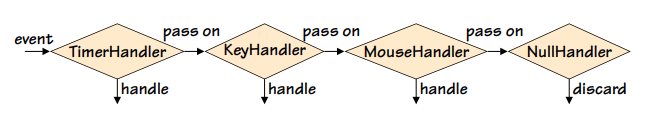

# Comportamentale - Chain of Responsability

- È utilizzato per separare il codice che effettua una richiesta da quello che la elabora.
- Invece di avere una funzione che invoca direttamente un’altra funzione, la prima funzione invia la richiesta ad una catena di destinatari.
    - il primo destinatario può elaborare la richiesta o passarla al prossimo destinatario e così via finché non è raggiunto l’ultimo destinatario che può decidere se scartare o lanciare l’eccezione.

### Esempio
```python
handler1 = TimerHandler(KeyHandler(MouseHandler(NullHandler())))
```


- A ciascun evento corrisponde una classe per la sua gestione.


- Gli eventi sono normalmente gestiti in un loop.
- Nel codice seguente si esce dal loop e si termina l’applicazione se c’è un evento TERMINATE; altrimenti si passa l’evento alla catena che gestisce gli eventi.

```python
while True:
	event = Event.next()
	if event.kind == Event.TERMINATE:
		break
	handler1.handle(event)
```
- chiedo alla catena di gestire i singoli eventi nella lista
  - finché non incontra un evento Terminate

### Classe NullHandler

- NullHandler serve come classe base per i nostri gestori di eventi e fornisce l’infrastruttura per gestire gli eventi.
- Se un’istanza è creata con un successore allora quando questa istanza riceve un evento, esso passa semplicemente l’evento al successore.
- Se invece l’istanza non ha un successore, l’evento viene scartato.
- Questo è l’approccio standard usato nella programmazione GUI, sebbene si possa facilmente lanciare l’eccezione per eventi non gestiti.

```python
class NullHandler:
	def __init__(self, successor=None):
		self._successor = successor

	def handle(self, event):
		if self._successor is not None:
			self._successor.handle(event)
```

### Classe MouseHandler

- Siccome nella classe seguente non viene reimplementato il metodo __init__(), viene usato il metodo __init()__ della classe base e di conseguenza la variabile self._successor viene creata correttamente.
- La classe MouseHandler gestisce solo gli eventi appropriati (di Event.MOUSE) e passa ogni altro tipo di evento al suo successore nella catena, se ve ne è uno.
- Le classi KeyHandler e TimerHandler hanno la stessa struttura di MouseHandler. Queste classi differiscono solo per il tipo di eventi che gestiscono e il tipo di gestione che svolgono (stampano messaggi differenti)

```python
class MouseHandler(NullHandler):
	def handle(self, event):
		if event.kind == Event.MOUSE:
			print("Click: {}".format(event))
		else:
			super().handle(event)
```

### Classe DebugHandler

- La classe DebugHandler non gestisce mai eventi. Il gestore di tipo DebugHandler deve essere il primo nella catena.
- Il metodo __init__ della classe riceve in input un file per scrivere al suo interno il report e quando accade un evento, riporta l’evento e poi lo passa avanti nella catena.

```python
class DebugHandler(NullHandler):
	def __init__(self, successor=None, file=sys.stdout):
		super().__init__(successor)
		 self.__file = file

	def handle(self, event):
		self.__file.write("*DEBUG*: {}\n".format(event))
		super().handle(event)
```

### Esempio Basato su Coroutine

- Un generatore è una funzione od un metodo che contiene una o più espressioni yield invece che dei return.
- Ogni volta che è raggiunto un yield, viene restituito un valore e l’esecuzione della funzione o del metodo è sospesa con il suo stato intatto.
- Quando il generatore è usato nuovamente, l’esecuzione riprende dallo statement successivo all’espressione yield.
- Una coroutine usa l’espressione yield allo stesso modo di un generatore ma ha un comportamento particolare in quanto esegue un loop infinito e comincia sospesa alla sua prima espressione yield, in attesa che venga inviato un valore.
- Nel caso vi sia un’unica espressione yield, una coroutine si comporta nel modo seguente:
    - se e quando viene inviato un valore con send, la coroutine lo riceve come valore dell’espressione yield in cui è sospesa in quel momento.
    - la coroutine riprende l’esecuzione e può poi fare qualsiasi computazione desideri nel corpo del ciclo e quando ha finito, essa cicla ancora e di nuovo sospende l’esecuzione in attesa di un valore da parte dell’espressione yield.
- I valori sono spinti in una coroutine attraverso il metodo send()

- Un generatore può essere trasformato in una coroutine mediante il decoratore @coroutine e mediante l’uso del loop infinito.

```python
def coroutine(function):
	@functools.wraps(function)
	def wrapper(*args, **kwargs):
		 generator = function(*args, **kwargs)
		 next(generator)
		 return generator
	return wrapper
```

- La funzione wrapper invoca la funzione *‘function’* una sola volta e cattura il generatore prodotto nella variabile generator. Questo generatore non è altro che la funzione originaria con gli argomenti e le variabili locali catturate nel suo stato.
- La funzione wrapper invoca poi next(generator) per arrivare alla prima espressione yield del generatore e restituisce il generatore. Questo generatore è una coroutine pronta per ricevere un valore alla sua prima (od unica) espressione yield.

- Siccome possiamo sia ricevere che inviare valori ad una coroutine, possiamo usare questi valori per creare delle pipeline, quali le catene per gestire gli eventi.
- Non abbiamo più bisogno di _successor perché possiamo usare la sintassi del generatore Python.

### Esempio Precedente basato su Coroutine


```python
def coroutine(function):
	@functools.wraps(function)
	def wrapper(*args, **kwargs):
		 generator = function(*args, **kwargs)
		 next(generator)
		 return generator
	return wrapper

pipeline = key_handler(mouse_handler(timer_handler()))

while True:
	event = Event.next()
	if event.kind == Event.TERMINATE:
		break
	pipeline.handle(event)

@coroutine
def key_handler(successor=None):
	while True:
		event = (yield)
		if event.kind == Event.KEYPRESS:
			 print("Press: {}".format(event))
		elif successor is not None:
		   successor.send(event)
            
class MouseHandler(NullHandler):
	def handle(self, event):
		if event.kind == Event.MOUSE:
			print("Click: {}".format(event))
		else:
			super().handle(event)

class NullHandler:
	def __init__(self, successor=None):
		self._successor = successor

	def handle(self, event):
		if self._successor is not None:
			self._successor.handle(event)

@coroutine
def debug_handler(successor, file=sys.stdout):
	while True:
		event = (yield)
		file.write("*DEBUG*:{}\n".format(event))
		successor.send(event)
```

- Come prima, una volta che la catena è pronta a gestire gli eventi, vengono gestiti con un loop.
- Siccome ogni funzione è una coroutine, ha il metodo send.
- Ogni volta che c’è un evento da gestire, è inviato alla pipeline con send.
- L’evento sarà prima inviato a key_handler().
- L’ordine dei gestori non è importante.
