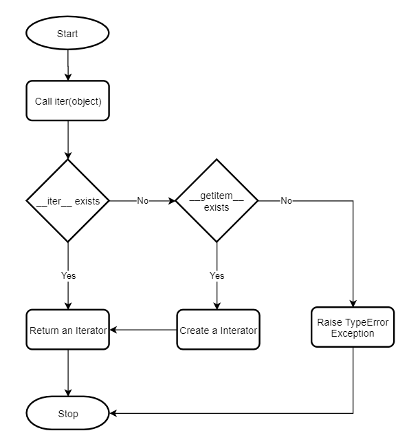

[Decoratori e Decorator Factory](https://www.pythontutorial.net/advanced-python/python-decorator-arguments/)
```python
def repeat(fn):
    @wraps(fn)
    def wrapper(*args, **kwargs):
        for _ in range(5):
            result = fn(*args, **kwargs)
        return result

    return wrapper    

@repeat
def say(message):
    ''' print the message 
    Arguments
        message: the message to show
    '''
    print(message)

"""Oppure, con Decorator Factory"""
def repeat(times):
    ''' call a function a number of times '''
    def decorate(fn):
        @wraps(fn)
        def wrapper(*args, **kwargs):
            for _ in range(times):
                result = fn(*args, **kwargs)
            return result
        return wrapper
    return decorate

@repeat(10)
def say(message):
    ''' print the message 
    Arguments
        message: the message to show
    '''
    print(message)

```

[Decoratori di Classe](https://www.pythontutorial.net/advanced-python/python-class-decorators/)
```python
class Star:
    def __init__(self, n):
        self.n = n

    def __call__(self, fn):
        def wrapper(*args, **kwargs):
            print(self.n*'*')
            result = fn(*args, **kwargs)
            print(result)
            print(self.n*'*')
            return result
        return wrapper

@Star(5)
def add(a, b):
    return a + b
"""esempio di output:"""
>> add(10, 20)
*****
30
*****
```

[Iteratori](https://www.pythontutorial.net/advanced-python/python-iterators/)

[IterATOR and IterABLE](https://www.pythontutorial.net/advanced-python/python-iterator-vs-iterable/)
- An iterable is an object that implements the \_\_iter__ method which returns an iterator.
- An iterator is an object that implements the \_\_iter__ method which returns itself and the \_\_next__ method which returns the next element.
- Iterators are also iterables.

[\_\_iter__](https://www.pythontutorial.net/advanced-python/python-iter/)


[Generatori](https://www.pythontutorial.net/advanced-python/python-generators/)
```python
def greeting():
    print('Hi!')
    yield 1
    print('How are you?')
    yield 2
    print('Are you there?')
    yield 3

>> messenger = greeting()
>> result = next(messenger)
>> print(result)
Hi!
1
>> result = next(messenger)
>> print(result)
How are you?
2

```